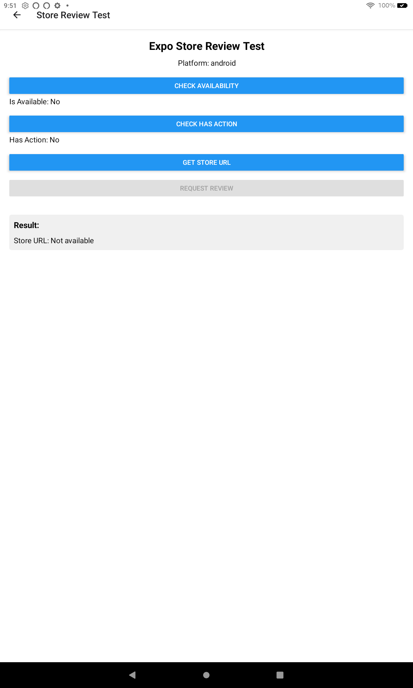

# Expo Store Review Test for Fire OS

This app tests the functionality of the expo-store-review package on Fire OS devices.



## Features

- **Store Review API Availability Check**: Verifies if the device supports in-app reviews
- **Store URL Retrieval**: Gets the Amazon Appstore URL for the app
- **In-App Review Request**: Tests the native review dialog functionality
- **Store Page Navigation**: Opens the app's page in the Amazon Appstore
- **Detailed Logging**: Provides real-time logs of all operations

## Fire OS Compatibility

This app specifically tests how the expo-store-review package works on Fire OS devices, which use the Amazon Appstore instead of Google Play. The implementation differences between these platforms can affect how in-app reviews function.

## Setup Instructions

### Prerequisites
- Node.js and npm installed
- Expo CLI installed (`npm install -g expo-cli`)
- A Fire OS device (Fire tablet or Fire TV)
- Developer options enabled on your Fire OS device

### Installation

1. Clone this repository:
   ```
   git clone https://github.com/mosesroth/fire-os-store-review.git
   cd fire-os-store-review
   ```

2. Install dependencies:
   ```
   npm install
   ```

3. Start the app:
   ```
   npx expo start
   ```

### Building for Fire OS

1. Build the app for Android:
   ```
   npx expo prebuild --platform android
   cd android
   ./gradlew assembleDebug
   ```

2. The APK will be generated at `android/app/build/outputs/apk/debug/app-debug.apk`

3. Install the APK on your Fire OS device

## Expected Behavior

- **Check Availability**: Should return whether the Store Review API is available
- **Get Store URL**: Should return an Amazon Appstore URL (typically starting with `amzn://`)
- **Request Review**: May show the Amazon Appstore review dialog if supported
- **Open Store Page**: Should open the Amazon Appstore to the app's page

## Technologies Used

- React Native
- Expo
- expo-store-review
